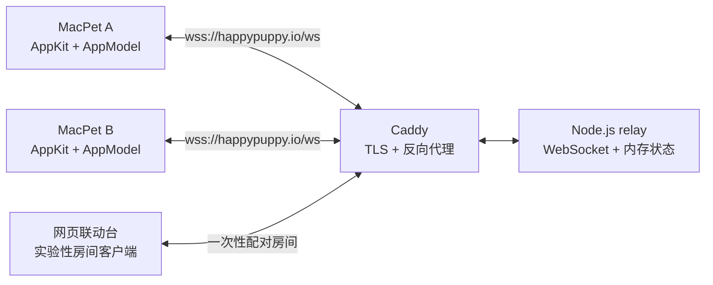

# 架构与协议

本文描述 MacPet 当前的运行结构、状态边界和 WebSocket 消息约定。实现以代码和测试为准。

## 系统结构

### macOS 客户端

- `AppDelegate` 负责应用生命周期、菜单栏和系统弹窗。
- `PetView` 与 `PetPanelController` 负责桌面宠物渲染和右键菜单。
- `AppModel` 是客户端状态中心，管理资料、好友、在线状态和互动反馈。
- `PublicPetInteractionService` 管理公网 WebSocket，并把网络消息转换为领域事件。
- `UserDefaults` 保存宠物名字、缩放比例、稳定 ID 和好友列表。

### Relay

Relay 使用 Node.js `ws`，所有房间和在线状态只保存在进程内存中。它提供两类连接：

1. 配对房间连接：用于首次交换宠物名字和稳定 ID，每个房间最多两个连接。
2. 在线状态连接：长期注册本机稳定 ID、名字和好友 ID 列表，并转发好友互动。

Relay 重启会清空临时配对房间和在线状态，但不会删除客户端本地保存的好友。

## 身份与好友模型

- 每个客户端首次启动时生成一个随机的 32 位十六进制稳定 ID。
- 4 位数字配对码只用于首次建立关系，不作为长期身份；Relay 继续接受旧版 8 位和 64 位码以便升级兼容。
- 配对成功后，双方分别在本机保存对方的稳定 ID。
- 只有双方都保存彼此、并且对方在线时，Relay 才报告好友在线。
- 好友互动按稳定 ID 定向转发，不依赖旧配对房间继续存在。

这套模型可以阻止已经被对方删除的单向好友继续显示在线或发送互动，但它不是账户级身份认证。安全边界见 [SECURITY.md](../SECURITY.md)。

## WebSocket 协议

所有消息均为 JSON。无效消息会被拒绝；协议违规通常以 WebSocket 关闭码 `1008` 结束连接。

### 配对房间

| 方向 | 类型 | 关键字段 | 用途 |
| --- | --- | --- | --- |
| 客户端 → Relay | `join` | `room`, `name`, `peerID` | 加入 4 位数字码或兼容旧版房间 |
| Relay → 客户端 | `joined` | `connected`, `peerName`, `peerID` | 返回当前房间状态 |
| Relay → 客户端 | `presence` | `connected`, `peerName`, `peerID` | 通知另一端加入或离开 |
| 客户端 → Relay | `profile` | `name` | 更新配对房间中的名字 |
| 客户端 → Relay | `event` | `kind`, `frameName` | 兼容房间内互动 |

未完成配对的单人房间默认 10 分钟后过期。

### 长期好友在线与互动

| 方向 | 类型 | 关键字段 | 用途 |
| --- | --- | --- | --- |
| 客户端 → Relay | `presence-register` | `peerID`, `name`, `friendPeerIDs` | 注册身份并订阅好友状态 |
| Relay → 客户端 | `presence-snapshot` | `onlinePeerIDs` | 返回当前双向在线好友 |
| Relay → 客户端 | `friend-presence` | `peerID`, `online` | 推送好友在线变化 |
| 客户端 → Relay | `friend-event` | `eventID`, `targetPeerID`, `kind`, `frameName` | 向双向在线好友发送互动 |
| Relay → 客户端 | `friend-event` | `senderPeerID`, `senderName`, `kind`, `frameName` | 投递互动 |
| Relay → 客户端 | `friend-event-delivered` | `eventID` | 确认互动已写入在线好友连接 |
| Relay → 客户端 | `friend-event-rejected` | `targetPeerID`, `message` | 目标离线或关系不再双向 |

互动类型为 `poke`、`heart` 或 `celebrate`。Relay 只接受客户端内置的动作素材名称，并对每个连接限制为每分钟 20 次发送。

## 失败与恢复

- 客户端和 Relay 都会定期发送 WebSocket 心跳；失活连接会被移除并自动重连。
- 在线状态连接断开后，客户端立即清空在线快照，不再把本地动作误报为发送成功。
- 配对房间失败时，客户端显示配对错误，不会保存未确认好友。
- 好友在发送前离线时，客户端禁用互动；若发送期间状态变化，Relay 会再次拒绝。
- Relay 进程重启后，已运行客户端会重连并重新提交好友订阅。

## 测试边界

- `Tests/MacPetTests` 覆盖客户端状态、资料迁移、配对、在线和删除好友行为。
- `relay/test` 覆盖房间隔离、短码兼容、双向在线状态、频率与定向转发。
- GitHub Actions 在 macOS 和 Linux runner 上分别验证客户端、relay、网页脚本、Compose 与 Docker 镜像。
