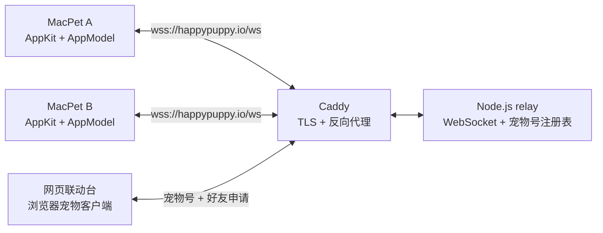

# 架构与协议

本文描述 MacPet 当前的运行结构、状态边界和 WebSocket 消息约定。实现以代码和测试为准。

## 系统结构

### macOS 客户端

- `AppDelegate` 负责应用生命周期、菜单栏和系统弹窗。
- `PetView` 与 `PetPanelController` 负责桌面宠物渲染和右键菜单。
- `AppModel` 是客户端状态中心，管理资料、好友、在线状态和互动反馈。
- `PublicPetInteractionService` 管理公网 WebSocket，并把网络消息转换为领域事件。
- `UserDefaults` 保存宠物名字、缩放比例、稳定 ID、设备认证令牌、宠物号缓存和好友列表。

### Relay

Relay 使用 Node.js `ws`。在线连接保存在进程内存中；永久宠物号、认证令牌哈希和好友申请写入 Docker volume 中的 JSON 注册表。它提供两类协议：

1. 身份与好友协议：注册稳定 ID 和设备令牌、分配永久宠物号，并处理好友申请。
2. 在线状态协议：提交本机好友 ID 列表，报告双方好友在线状态并转发互动。

旧版一次性配对房间仍暂时保留用于升级兼容，不再出现在新版客户端界面。Relay 重启会清空在线状态和旧版临时房间，但不会丢失宠物号或未处理申请。

## 身份与好友模型

- 每个客户端首次启动时生成一个随机的 32 位十六进制稳定 ID。
- 同时生成一个随机的 64 位设备认证令牌；Relay 只保存其 SHA-256 哈希，用它防止其他客户端冒用稳定 ID。
- Relay 为身份分配唯一的 6 位数字宠物号。号码可重复使用，也可由主人主动更换。
- 输入宠物号只会创建好友申请；接收方明确接受后，双方才保存对方的稳定 ID。
- 只有双方都保存彼此、并且对方在线时，Relay 才报告好友在线。
- 好友互动按稳定 ID 定向转发，不依赖旧配对房间继续存在。

这套模型可以阻止陌生人只凭宠物号直接互动，也可以阻止已经被对方删除的单向好友继续显示在线或发送互动，但它不是账户级身份认证。安全边界见 [SECURITY.md](../SECURITY.md)。

## WebSocket 协议

所有消息均为 JSON。无效消息会被拒绝；协议违规通常以 WebSocket 关闭码 `1008` 结束连接。

### 永久宠物号与好友申请

| 方向 | 类型 | 关键字段 | 用途 |
| --- | --- | --- | --- |
| 客户端 → Relay | `presence-register` | `peerID`, `authToken`, `name`, `friendPeerIDs` | 认证身份并注册在线状态 |
| Relay → 客户端 | `pet-code` | `petCode` | 返回当前永久宠物号 |
| 客户端 → Relay | `friend-request-create` | `petCode` | 向宠物号主人发送好友申请 |
| Relay → 客户端 | `friend-request-incoming` | `requestID`, `senderPeerID`, `senderName` | 推送或补发待处理申请 |
| 客户端 → Relay | `friend-request-respond` | `requestID`, `accept` | 接受或拒绝申请 |
| Relay → 客户端 | `friend-request-accepted` | `requestID`, `peerID`, `name` | 通知双方保存好友 |
| Relay → 客户端 | `friend-request-rejected` | `requestID` | 通知申请方被拒绝 |
| 客户端 → Relay | `friend-request-ack` | `requestID` | 确认结果已保存，可清理通知 |
| 客户端 → Relay | `pet-code-reset` | - | 让旧号码失效并分配新号码 |

申请和结果会持久化；任意一方离线后重新连接仍可收到。已接受的结果在相关客户端确认保存前不会被清理。

### 长期好友在线与互动

| 方向 | 类型 | 关键字段 | 用途 |
| --- | --- | --- | --- |
| 客户端 → Relay | `presence-register` | `peerID`, `authToken`, `name`, `friendPeerIDs` | 注册身份并订阅好友状态 |
| Relay → 客户端 | `presence-snapshot` | `onlinePeerIDs` | 返回当前双向在线好友 |
| Relay → 客户端 | `friend-presence` | `peerID`, `online` | 推送好友在线变化 |
| 客户端 → Relay | `friend-event` | `eventID`, `targetPeerID`, `kind`, `frameName` | 向双向在线好友发送互动 |
| Relay → 客户端 | `friend-event` | `senderPeerID`, `senderName`, `kind`, `frameName` | 投递互动 |
| Relay → 客户端 | `friend-event-delivered` | `eventID` | 确认互动已写入在线好友连接 |
| Relay → 客户端 | `friend-event-rejected` | `targetPeerID`, `message` | 目标离线或关系不再双向 |

互动类型为 `poke`、`heart` 或 `celebrate`。Relay 只接受客户端内置的动作素材名称，并对每个连接限制为每分钟 20 次发送。

## 失败与恢复

- 客户端和 Relay 都会定期发送 WebSocket 心跳；失活连接会被移除并自动重连。
- Relay 延迟 5 秒广播离线状态；客户端在该窗口内重连时，好友不会看到短暂的离线闪烁。
- 在线状态连接断开后，客户端立即清空在线快照，不再把本地动作误报为发送成功。
- 好友申请失败时，客户端显示明确错误，不会保存未经对方接受的好友。
- 好友在发送前离线时，客户端禁用互动；若发送期间状态变化，Relay 会再次拒绝。
- Relay 进程重启后，已运行客户端会重连并重新提交好友订阅。

## 测试边界

- `Tests/MacPetTests` 覆盖客户端状态、资料迁移、宠物号、好友申请、在线和删除好友行为。
- `relay/test` 覆盖注册表重启恢复、宠物号更换、好友申请、断线宽限、双向在线状态、频率与定向转发。
- GitHub Actions 在 macOS 和 Linux runner 上分别验证客户端、relay、网页脚本、Compose 与 Docker 镜像。
