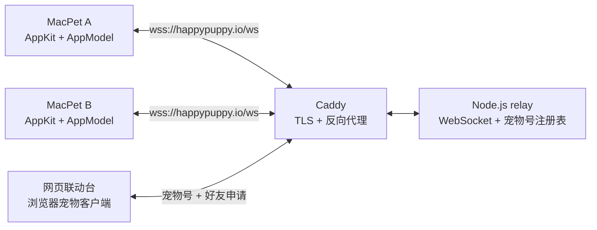

# 架构与协议

本文描述 MacPet 当前的运行结构、状态边界和 WebSocket 消息约定。实现以代码和测试为准。

## 系统结构

### macOS 客户端

- `AppDelegate` 负责应用生命周期、菜单栏和系统弹窗。
- `PetView` 与 `PetPanelController` 负责桌面宠物渲染和右键菜单。
- `AppModel` 是客户端状态中心，管理资料、好友、在线状态和互动反馈。
- `PublicPetInteractionService` 管理公网 WebSocket，并把网络消息转换为领域事件。
- `UserDefaults` 保存宠物名字、缩放比例、稳定 ID、设备认证令牌、宠物号缓存、好友列表和最近 50 条留言。

### Relay

Relay 使用 Node.js `ws`。在线连接保存在进程内存中；永久宠物号、认证令牌哈希、服务端好友关系与删除墓碑、好友申请和未确认保存的留言写入 Docker volume 中的 JSON 注册表。单帧上限为 16 KiB。它提供三类协议：

1. 身份与好友协议：注册稳定 ID 和设备令牌、分配永久宠物号，并处理好友申请。
2. 在线状态协议：提交本机好友 ID 列表，报告双方好友在线状态并转发实时互动。
3. 好友留言协议：转发短文字或预设贴纸，好友离线时排队并在其上线时补发。

旧版一次性配对房间仍暂时保留用于升级兼容，不再出现在新版客户端界面。Relay 重启会清空在线状态和旧版临时房间，但不会丢失宠物号或未处理申请。

## 身份与好友模型

- 每个客户端首次启动时生成一个随机的 32 位十六进制稳定 ID。
- 同时生成一个随机的 64 位设备认证令牌；Relay 只保存其 SHA-256 哈希，用它防止其他客户端冒用稳定 ID。
- Relay 为身份分配唯一的 6 位数字宠物号。号码可重复使用，也可由主人主动更换。
- 输入宠物号只会创建好友申请；接收方明确接受后，客户端与 Relay 才把双方稳定 ID 记录为好友。
- 每个身份最多保存 100 个好友；接受申请会先原子检查双方容量，任一方已满时不会写入半完成关系。
- 删除好友使用独立的认证操作；Relay 同时撤销双方关系、清理两者间的排队留言并记录墓碑，旧会话重发过期列表不能恢复关系，重新接受好友申请会清除墓碑。
- 只有双方都保存彼此、并且对方在线时，Relay 才报告好友在线。
- 好友互动按稳定 ID 定向转发，不依赖旧配对房间继续存在。

这套模型可以阻止陌生人只凭宠物号直接互动，也可以阻止已经被对方删除的单向好友继续显示在线或发送互动，但它不是账户级身份认证。安全边界见 [SECURITY.md](../SECURITY.md)。

## WebSocket 协议

所有消息均为 JSON。无效消息会被拒绝；协议违规通常以 WebSocket 关闭码 `1008` 结束连接。

### 永久宠物号与好友申请

| 方向 | 类型 | 关键字段 | 用途 |
| --- | --- | --- | --- |
| 客户端 → Relay | `presence-register` | `peerID`, `authToken`, `name`, `friendPeerIDs` | 认证身份并注册在线状态 |
| Relay → 客户端 | `pet-code` | `petCode` | 返回当前永久宠物号 |
| 客户端 → Relay | `friend-request-create` | `petCode` | 向宠物号主人发送好友申请 |
| Relay → 客户端 | `friend-request-incoming` | `requestID`, `senderPeerID`, `senderName` | 推送或补发待处理申请 |
| 客户端 → Relay | `friend-request-respond` | `requestID`, `accept` | 接受或拒绝申请 |
| Relay → 客户端 | `friend-request-accepted` | `requestID`, `peerID`, `name` | 通知双方保存好友 |
| Relay → 客户端 | `friend-request-rejected` | `requestID` | 通知申请方被拒绝 |
| 客户端 → Relay | `friend-request-ack` | `requestID` | 确认结果已保存，可清理通知 |
| 客户端 → Relay | `friend-remove` | `targetPeerID` | 请求撤销双方好友关系 |
| Relay → 客户端 | `friend-removed` | `peerID` | 确认双方关系已撤销，通知在线双方删除本地好友 |
| Relay → 客户端 | `friend-remove-failed` | `peerID`, `message` | 删除请求无效或频率超限 |
| 客户端 → Relay | `pet-code-reset` | - | 让旧号码失效并分配新号码 |

申请和结果会持久化；任意一方离线后重新连接仍可收到。全局最多保存 10000 条申请记录；待处理申请使用 30 天 TTL，已接受/拒绝但尚未 ACK 的结果使用 7 天 TTL，并由每分钟清理器主动删除。申请 ACK 与留言 ACK 都要求已认证会话，并共用按稳定 ID 每分钟 300 次、按来源地址每分钟 3000 次的限流；未认证连接不能消耗其自报稳定 ID 的额度。

### 长期好友在线与互动

| 方向 | 类型 | 关键字段 | 用途 |
| --- | --- | --- | --- |
| 客户端 → Relay | `presence-register` | `peerID`, `authToken`, `name`, `friendPeerIDs` | 注册身份并订阅好友状态 |
| Relay → 客户端 | `presence-snapshot` | `onlinePeerIDs` | 返回当前双向在线好友 |
| Relay → 客户端 | `friend-presence` | `peerID`, `online` | 推送好友在线变化 |
| 客户端 → Relay | `friend-event` | `eventID`, `targetPeerID`, `kind`, `frameName` | 向双向在线好友发送互动 |
| Relay → 客户端 | `friend-event` | `senderPeerID`, `senderName`, `kind`, `frameName` | 投递互动 |
| Relay → 客户端 | `friend-event-delivered` | `eventID` | 确认互动已写入在线好友连接 |
| Relay → 客户端 | `friend-event-rejected` | `targetPeerID`, `message` | 目标离线或关系不再双向 |

互动类型为 `poke`、`heart` 或 `celebrate`。Relay 只接受客户端内置的动作素材名称，并对每个连接限制为每分钟 20 次发送。

认证在线注册在写盘前按稳定 ID 每分钟限制 21 次、按来源地址每分钟限制 600 次；同一来源地址每小时最多创建 20 个新身份，注册表总容量为 100000 个身份。删除好友按稳定 ID 每分钟限制 10 次、按来源地址每分钟限制 100 次，所有幂等重试也计数。来源地址默认使用 TCP 对端；生产 Compose 因 Relay 仅在内部网络接受 Caddy 连接而显式开启 `MACPET_TRUST_PROXY`，其他直接暴露 Relay 的部署应保持关闭。

### 好友留言（短文字与预设贴纸）

| 方向 | 类型 | 关键字段 | 用途 |
| --- | --- | --- | --- |
| 客户端 → Relay | `friend-message-send` | `messageID`, `targetPeerID`, `kind`, `body` | 发送文字或贴纸留言 |
| Relay → 客户端 | `friend-message-sent` | `messageID` | 确认已通过授权并持久化入队 |
| Relay → 客户端 | `friend-message-incoming` | `messageID`, `senderPeerID`, `senderName`, `kind`, `body`, `createdAt` | 在线实时投递或上线补发 |
| 客户端 → Relay | `friend-message-ack` | `messageID` | 确认已保存，删除服务端副本 |
| Relay → 客户端 | `friend-message-failed` | `messageID`, `message` | 非好友、频率超限或身份未认证 |

留言 `kind` 为 `text` 或 `sticker`。文字经过 trim 且长度上限为 300 个 Unicode code point；贴纸取值必须在 Relay 白名单内。发送要求会话已认证、目标身份已注册，且服务端关系仍为双向。接受好友申请时 Relay 会先写入双向关系；任意一方发出 `friend-remove` 后，相关未确认留言立即清理并写入删除墓碑，只有以后再次接受申请才能恢复关系。

与实时互动不同，留言先写入注册表：好友在线时立即投递，离线时排队，上线时补发。相同 `messageID` 和相同正文可安全重试；同 ID 的冲突正文或目标会被拒绝。Mac 在响应丢失后重连会沿用同一 ID，只有收到 `friend-message-sent` 才显示成功。Mac 写入 `UserDefaults`、Web 写入 `localStorage` 后才发送 `friend-message-ack`，Relay 随后删除服务端副本。留言使用 7 天 TTL，每分钟主动清理一次；每个接收方最多 50 条并淘汰自己的最旧消息，全局最多 5000 条且满额后拒绝新消息。发送限流按认证稳定 ID 跨连接为每分钟 30 条、按来源地址为每分钟 300 条。

## 失败与恢复

- 客户端和 Relay 都会定期发送 WebSocket 心跳；失活连接会被移除并自动重连。
- Relay 延迟 5 秒广播离线状态；客户端在该窗口内重连时，好友不会看到短暂的离线闪烁。
- 在线状态连接断开后，客户端立即清空在线快照，不再把本地动作误报为发送成功。
- 好友申请失败时，客户端显示明确错误，不会保存未经对方接受的好友。
- 好友在发送前离线时，客户端禁用互动；若发送期间状态变化，Relay 会再次拒绝。
- 留言发送响应丢失时，Mac 保留同一 `messageID` 并在在线状态连接恢复后重发；10 秒内仍无确认才报告传输失败。
- 删除好友只在收到 Relay `friend-removed` 后落到本地；确认丢失时本地关系保留，用户可联网重试，不会把本地成功误当成服务端撤权。
- Relay 进程重启后，已运行客户端会重连并重新提交好友订阅。

## 测试边界

- `Tests/MacPetTests` 覆盖客户端状态、资料迁移、宠物号、好友申请、在线、删除好友以及好友留言的收发、去重、持久化与已读状态。
- `relay/test` 覆盖注册表重启恢复、身份/好友/申请容量、注册限流、宠物号更换、好友申请与结果 TTL、断线宽限、双向在线状态、频率、定向转发，以及好友留言的双向授权、入队、离线补发、主动 TTL 清理、全局容量、冲突 ID、跨连接限流、16 KiB 帧上限、旧会话竞态、删除墓碑/重放限流、Unicode 边界与贴纸白名单。
- GitHub Actions 在 macOS 和 Linux runner 上分别验证客户端、relay、网页脚本、Compose 与 Docker 镜像。
